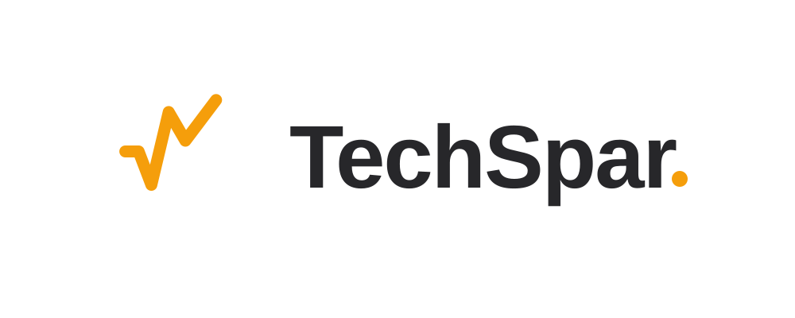

<div align="center">



**Connect focused drills, resume interviews, JD prep, realtime Copilot, and recording review into one continuously improving technical interview loop.**

[Online Demo](https://techspar.cn/) · [Quick Start](#quick-start) · [中文](README.md)

[](https://bun.sh/)
[](https://hono.dev/)
[](https://www.electronjs.org/)
[](https://react.dev/)
[](https://www.docker.com/)


</div>

TechSpar is more than a question generator. Focused drills, resume interviews, JD prep, realtime Copilot, and recording review share the same long-term profile, knowledge base, weak points, and review schedule. Every result changes what the next round focuses on.

## Versions and branches

- **`main`** is the current product. The backend is fully TypeScript, Bun, and Hono, with one Bun workspace for backend and frontend dependencies. All new work continues here.
- **`legacy/python-backend`** preserves the final Python and FastAPI implementation at commit `73d1a7c`. It is a read-only historical fallback and receives no new features.

Never run both branches against the same writable data directory. Use a separate checkout and a copied dataset when inspecting the legacy implementation.

## Capabilities

- Adaptive focused drills backed by knowledge, mastery, and training history
- Resume mock interviews with a durable TypeScript state machine
- JD-specific preparation and questioning strategies
- Realtime Copilot with ASR, follow-up prediction, answer guidance, alerts, and optional voiceprint roles
- Long and short recording transcription with structured review
- Long-term profile, weak-point tracking, and SM-2 review scheduling
- Personal document library and personal Agent context
- Safe per-account and administrator data migration archives

## Quick start

Requirements: Bun `1.3.14` or a compatible `1.3.x` release.

```bash
git clone https://github.com/AnnaSuSu/TechSpar.git
cd TechSpar
bun install --frozen-lockfile
cp .env.example .env
```

### Electron desktop client

Download macOS and Windows installers from [GitHub Releases](https://github.com/AnnaSuSu/TechSpar/releases) and sign in online to use them. The commands below build a desktop application with a local backend from source.

Run Vite, Hono, and Electron together in development:

```bash
bun run dev:desktop
```

Build an unpacked application or distributable artifacts for the current platform:

```bash
bun run pack:desktop
bun run dist:desktop
```

Build for a specific target platform:

```bash
bun run dist:desktop:mac-arm64 # macOS Apple Silicon: DMG + ZIP
bun run dist:desktop:win-x64   # Windows x64: NSIS installer
```

Artifacts are written to `dist/desktop/`. Applications built from source include Electron and a compiled Bun backend, so end users do not need Bun. The repository configures macOS DMG/ZIP, Windows NSIS, and Linux AppImage/DEB targets.

### Web development

Start the API and Web app in separate terminals:

```bash
bun run dev:api
bun run dev:web
```

Open <http://localhost:5173>. The development login is `admin@techspar.local` / `admin123`. Change `JWT_SECRET` and the default password before deployment.

Docker is also supported:

```bash
docker compose up --build
```

Then open <http://localhost>.

## Models and optional services

When self-hosting or building the desktop application from source, configure LLM, embedding, DashScope, Tavily, OSS, and Tencent VPR credentials in Settings. Credentials are user-scoped. `.env` only contains bootstrap settings and optional platform fallback models.

- Any OpenAI-compatible chat and embeddings API is supported.
- Local embeddings use Transformers.js and ONNX. The default is `Xenova/bge-m3`; it downloads and caches on first use with no Python, PyTorch, or pip dependency.
- DashScope powers voice input, recording transcription, and Copilot realtime ASR.
- Tavily adds company research, OSS supports long-audio jobs, and Tencent VPR optionally distinguishes interviewer and candidate voices.

## Validation

```bash
bun run check
bun run gen:api
```

The first command runs Bun and Node type checks, architecture checks, backend and frontend tests, and production builds. The second regenerates OpenAPI and frontend types.

Desktop-specific validation is available through `bun run smoke:desktop`, `bun run smoke:local-embedding`, and `bun run pack:desktop`.

## Data and backups

Data defaults to `data/`: SQLite stores sessions and tasks, while user files live under `data/users/{user_id}/`. The Settings page exports portable personal backups and administrator system backups. Imports validate paths, links, tar checksums, and expanded size, then safely rebind personal data to the current account. Vector indexes are rebuilt after import.

Electron uses the operating system's standard application-data directory for databases, user files, model caches, and per-install random runtime secrets. Its Hono sidecar listens only on a dynamic `127.0.0.1` port.

## Contributing

Issues and pull requests are welcome. See [CONTRIBUTING.md](CONTRIBUTING.md) for development conventions.
